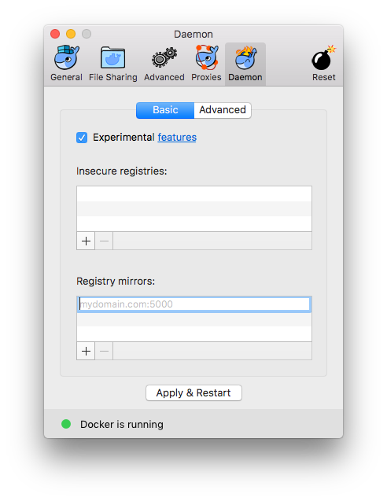

# Docker Hub Proxy

This image sets up a Docker Registry that proxies to Docker Hub but caches the
images it has downloaded.

### Running the image

```
docker run -d -p 5000:5000 --name dockerhub-proxy kruszczynski/dockerhub-proxy
```

### Using the proxy (macOS)

Add `http://<your-id-or-address>:5000` to Registry section of Daemon pane of
Docker for Mac preferences:


